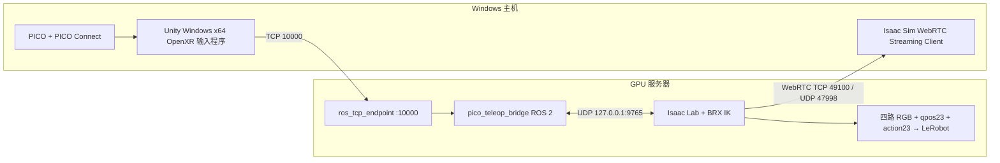

# PICO + ROS 2 + Isaac Lab 遥操作（BRX042501）

本项目已固定为一套主机/服务器分离架构：PICO 只给 Windows 主机提供头显和手柄追踪；Windows Unity 程序把标准 ROS 2 消息经 ROS-TCP 发到服务器；Isaac Lab、ROS 2、四相机采集和 LeRobot 数据写盘全部运行在服务器。Isaac Sim WebRTC 是独立的画面回传通道，不承担控制通信。



这不是可选方案列表，而是本项目唯一支持的部署方式：

- Windows 主机安装 PICO Connect、Unity 输入程序和 Isaac Sim WebRTC Streaming Client；不安装 ROS 2、Isaac Lab、LeRobot。
- GPU 服务器安装 Isaac Lab 2.3.2、Isaac Sim 5.1 对应运行时、ROS 2 Humble、LeRobot 和本项目 ROS 工作区。
- PICO 不直连服务器，也不运行 Android 遥操作 APK；它通过 PICO Connect 作为 Windows PCVR/OpenXR 设备。
- ROS 2 DDS 全部留在服务器。跨主机只开放 ROS-TCP 和 WebRTC；UDP 9765 永远只绑定服务器回环地址。
- 固定地址为 Windows 主机 `192.168.50.61`、GPU 服务器 `192.168.50.227`。防火墙只允许 `192.168.50.61` 访问服务器 TCP `10000`、TCP `49100`、UDP `47998`。

## 已实现

- 双手柄绝对位姿输入，首次开始和暂停恢复后自动重新标定。
- trigger 控制左右夹爪；支持位置控制和完整位置姿态控制。
- `start / pause / resume / stop / reset / calibrate` 状态机。
- 350 ms 看门狗、跟踪丢失保持、单帧位移/旋转限制和工作空间裁剪。
- 暂停时保持机器人、继续 WebRTC 渲染和状态回传、不写数据帧。
- 四路同步相机：`head_left`、`head_right`、`left_wrist`、`right_wrist`。
- 固定 23 维 `observation.state` 与实际下发 `action` ABI。
- 使用官方 `LeRobotDataset` API 原生写 v2.1 或 v3；两种格式使用不同数据目录和对应 LeRobot 环境。
- ROS 2 标准消息、标准 `Trigger` 服务、可靠事件重发和状态确认。

## 开始使用

严格按 [详细操作手册](docs/操作手册.md) 的顺序执行。专项说明：

- [Windows PICO/Unity 接入](docs/PICO_Unity接入.md)
- [ROS 2 接口与进程边界](docs/ROS2接口.md)
- [LeRobot v2.1 / v3 数据格式](docs/LeRobot数据格式.md)

服务器上最终只需启动两个入口：

```bash
# 终端 1：同时启动 ROS-TCP endpoint 和 PICO bridge
source /opt/ros/humble/setup.bash
source /home/kemove/zzk_data/pico-teleop/ros2_ws/install/setup.bash
ros2 launch pico_teleop_bridge pico_teleop.launch.py

# 终端 2：启动 Isaac Lab、WebRTC 和数据记录
cd /home/kemove/zzk_data/IsaacLab
./isaaclab.sh -p /home/kemove/zzk_data/pico-teleop/scripts/run_sim.py \
  --livestream 2 --enable_cameras --device cuda:0 \
  --urdf_path /home/kemove/zzk_data/IsaacLab/BRX042501/BRX042501_wheel_4cams.urdf \
  --teleop_assets_root /home/kemove/zzk_data/IsaacLab/teleop/assets \
  --record_root /home/kemove/zzk_data/datasets/brx_pico_v3 --lerobot_format v3
```

代码已移除 Isaac 进程直接导入 `rclpy`、跨机 UDP 和 Windows 本地仿真入口，避免运行时误接到另一套拓扑。

## 已核对的参考场景

当前 Windows 主机的 `D:\IsaacLabCode` 与服务器 `/home/kemove/zzk_data/IsaacLab` 内容对应，服务器仓库为 Isaac Lab `2.3.2`。BRX 四相机 URDF 契约为 44 个 joint、33 个 non-fixed joint，头部双目基线为 0.060 m。遥操作项目在服务器固定使用 `/home/kemove/zzk_data/pico-teleop`。

## 文件结构

```text
pico_isaaclab/                  Isaac Lab、控制、相机、录制、回环传输
ros2_ws/src/pico_teleop_bridge  ROS 2 PICO 桥
ros2_ws/src/ROS-TCP-Endpoint    Unity 官方 main-ros2 endpoint
unity/Assets/Scripts/           Windows PCVR/OpenXR 发布脚本
scripts/                        启动、预检、校验工具
tests/                          不依赖 Isaac Sim 的契约测试
docs/                           中文部署和接口文档
```
